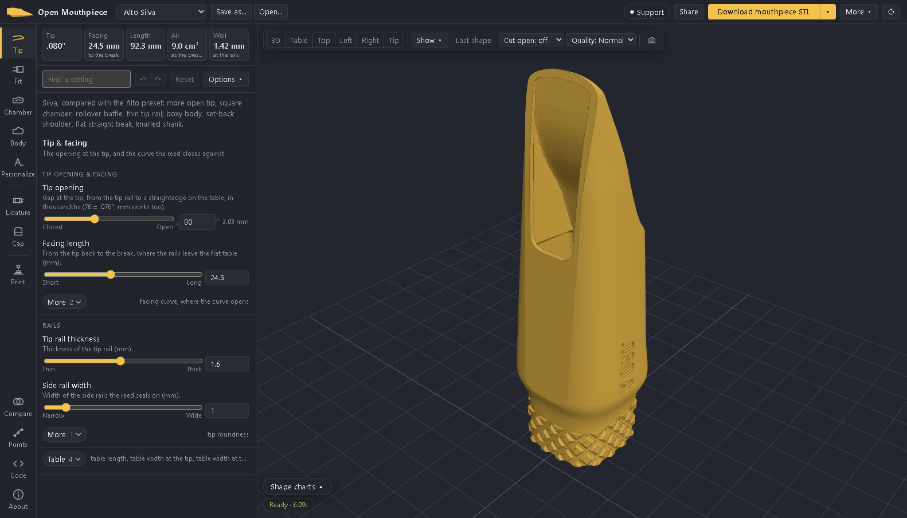
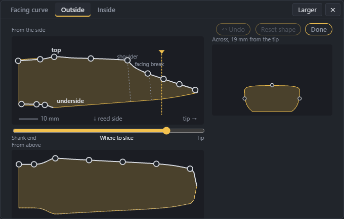
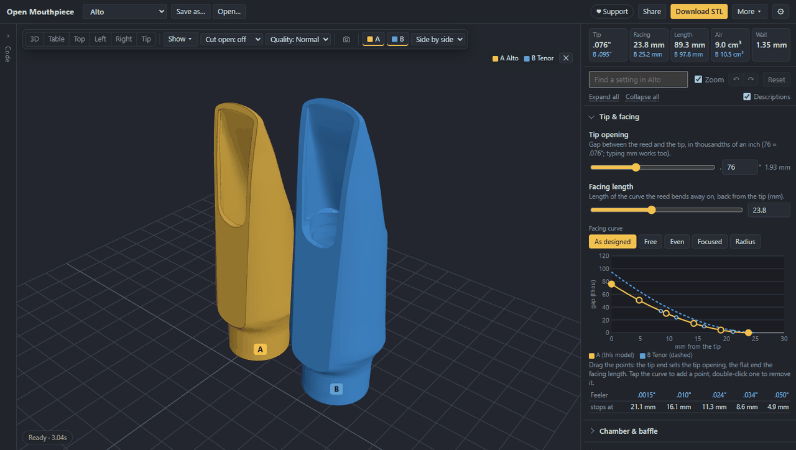
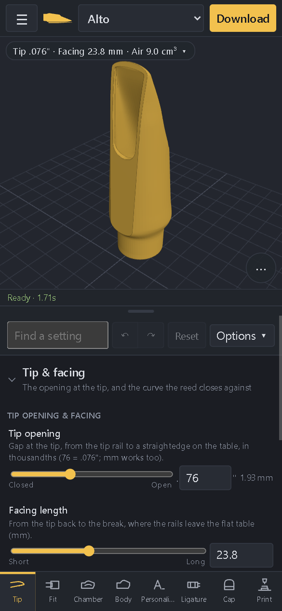

# Open Mouthpiece user guide

Open Mouthpiece is a free web app for designing saxophone mouthpieces and 3D printing them. You
pick a soprano, alto, tenor or baritone mouthpiece to start from, adjust things like the tip
opening, facing, baffle and chamber, and download a file to print. Everything happens in your
browser. You don't need an account or any software, and your designs aren't stored on our server.

Open Mouthpiece is AI-generated: the app, the mouthpiece generator and this guide were written by
Claude, Anthropic's AI model, directed by a saxophonist who prints and plays the results.

Open the app at https://opensaxmouthpiece.org.

**Contents**

1. [Getting started](#1-getting-started)
2. [The screen](#2-the-screen)
3. [Choosing a starting point](#3-choosing-a-starting-point)
4. [Changing settings](#4-changing-settings)
5. [What each section covers](#5-what-each-section-covers)
6. [Shape charts](#6-shape-charts)
7. [Readouts](#7-readouts)
8. [The 3D view](#8-the-3d-view)
9. [Comparing designs](#9-comparing-designs)
10. [Ligature and cap](#10-ligature-and-cap)
11. [Saving, opening and sharing](#11-saving-opening-and-sharing)
12. [Downloading and printing](#12-downloading-and-printing)
13. [Phones and tablets](#13-phones-and-tablets)
14. [Using OpenSCAD](#14-using-openscad)
15. [App settings and privacy](#15-app-settings-and-privacy)
16. [Troubleshooting](#16-troubleshooting)
17. [Other documents](#17-other-documents)

## 1. Getting started

1. Open the app. The alto mouthpiece loads first.
2. Choose your saxophone in the list at the top left (Soprano, Alto, Tenor or Baritone).
3. Click **Fit** on the left and enter the diameter of your neck cork. If you don't know it, leave
   the default, which suits most necks.
4. Make your changes. **Tip** has the tip opening and facing, **Chamber** has the inside and
   **Body** has the outside. The model updates a few seconds after each change.
5. Before printing the whole mouthpiece, print a shank test ring to check the fit on your cork.
   Click the small arrow next to the yellow Download button and choose **Shank test ring**. It only
   takes a few minutes to print.
6. Click **Download mouthpiece STL** to get the file for your printer. It's already oriented for
   printing.
7. Click **Save as…** to keep your design.

The [printing guide](PRINTING.md) covers the rest: printer settings, sanding the table and facing,
checking the print, and making changes after you've played it.

## 2. The screen

On a computer, the app has four areas.

The **top bar** has the design list, **Save as…** and **Open…** on the left. On the right are
**Support**, **Share**, the **Download** button with its arrow menu, **More** and the **⚙**
settings.

The **icon bar** down the left side opens each group of settings: Tip, Fit, Chamber, Body and
Personalize for the mouthpiece, then Ligature, Cap and Print. Compare, Points, Code and About are
at the bottom. A dot or number on a button means you've changed something in that group.

The **settings panel** next to it shows the measurements at the top and the settings for the group
you picked below them.

The **3D view** shows the mouthpiece. The view controls are along its top, and the **Shape charts**
button is at the bottom left.

When you open a group of settings, the view turns to the part of the mouthpiece those settings
change. You can drag the borders between the columns to resize them.

## 3. Choosing a starting point

The list at the top left contains:

- The four standard mouthpieces: soprano, alto, tenor and baritone. These are based on
  measurements of well-known 3D-printed mouthpieces (see the credits in About). The alto, tenor
  and baritone versions have been printed and played.
- Three variations of each, called Flamma, Silva and Unda. Each one changes several settings at
  once and adds some lettering and decoration as an example. A short note above the settings
  explains how it differs from the standard version.
- A C-melody mouthpiece, under Extras.
- Your own saved designs.
- Any .scad files you've opened.

You can't overwrite the built-in designs, but you can change them as much as you like and then
use **Save as…** to keep your version under a new name. If "(edited)" appears after the name, the
design has changes that haven't been saved.

## 4. Changing settings

Each setting has a slider and a box where you can type an exact number. The words under each end of
the slider tell you what that direction does, such as Closed and Open or Short and Long. A short
description under each setting gives the unit. If you'd rather not see the descriptions, turn
them off under **Options**.

The longer sections are split into small groups, one per part (for example Baffle, Chamber,
Throat and Window), each under a small heading. A group shows its main settings first. Click
**More** under it to see the rest of that group's settings. A group with nothing but smaller
settings, like Table, shows only its own button. Settings that only matter after you pick
something, such as a texture's depth, appear right under it once you do.

To find a particular setting, type part of its name in the **Find a setting** box, for example
"baffle" or "window".

Use the ↶ and ↷ buttons (or Ctrl+Z and Ctrl+Y) to undo and redo. **Reset** takes the design back
to how it was when you opened or last saved it, and the number on the button shows how many
settings you've changed.

Two more options are in the **Options** menu. **Auto-zoom** moves the view to whatever part a
setting affects, and cuts the model open for parts on the inside. Turn it off if you'd rather the
view stayed put. **Compare with the original** puts the unchanged design next to yours.

The app won't let you make a mouthpiece that can't be printed. If a setting would make a wall too
thin, the app limits it and a note under the measurements tells you.

## 5. What each section covers

For a full list of settings with before-and-after pictures, see [Every setting](PARAMETERS.md).
The [glossary](GLOSSARY.md) explains the parts of a mouthpiece and which settings change each one.

**Tip & facing.** *Tip opening & facing*: the tip opening is in thousandths of an inch, but you
can type a value in mm too. The facing length is measured from the tip back to the break, where the
rails leave the flat table; its More has the shape of the facing curve. *Rails*: the thickness of
the tip rail and the width of the side rails, with the roundness of the tip under More. *Table*:
the table's length, width and hollow.

**Fit on the horn.** Enter your neck cork's diameter here, and set the cork squeeze, which is how
much smaller the socket is than the cork. A bigger number gives a tighter fit, and 0.1 to 0.3 mm is
typical. You can also set how far the cork goes in, and download a shank test ring. Under More
settings are the bevel at the opening of the socket, the bore size and the angle of the table.

**Chamber & baffle.** The inside of the mouthpiece, in four groups. *Baffle*: its shape, height and
hump, and a texture on it (grooves along it, grooves across it, or dimples, engraved or raised, with
their depth and spacing); More has where the baffle starts and how it curves. *Chamber*: its shape
(round, square or horseshoe) and width; More has its height and floor, how it widens past the
throat and the angle of its side walls. *Throat*: its width; More has its position, the narrowing
into it and its shape. *Window*: its width; More has its length and corners.

**Body & beak.** The outside, in three groups. *Size*: overall length and the width and height of
the body, with the shank's outside diameter under More. *Beak*: its height at the tip, curve,
length and top. *Shoulder & sides*: the shoulder and the sides near the table, with the shoulder
sweep and the body's cross-section under More.

**Personalize.** Add text and a picture *On top*, text on the *Sides*, and text around the *Shank
band*, where you can also add rings, flutes, a spiral or knurling. You can use one of the built-in
pictures or upload your own SVG file. Click **Variables** next to a text box to insert values from
the design, such as the tip opening (`{tip}`) or the design's name (`{title}`). Text can run over
several lines. The same font is used for all text (*All lettering*) unless you choose a different
one for a particular text under its group's More. Text on the mouthpiece is always engraved so the
ligature can't catch on it.

**Ligature and Cap.** Their settings come in groups too: the ligature's *Band*, *Fit* and *Text &
picture*; the cap's *Goes over*, *Fit & slot*, *Shape*, *Air holes & vents* and *Text & picture*.

**Print.** Choose whether to print the mouthpiece or a shank test ring. **Extra to sand off** adds
a little material to the table and facing so you can sand them flat after printing (the printing
guide explains when to use it). You can also download the print kit here. Under More settings are
the minimum wall thickness, the smoothness of the model, and the print orientation.

## 6. Shape charts

Click **Shape charts** at the bottom left of the 3D view to open a panel with three charts. Use
**Larger** and **Smaller** to resize it.

**Facing curve** shows the gap between the reed and the rails from the tip back to the break. You
can pick a ready-made curve (As designed, Opens early, Even, Opens late or Radius), or drag the
points yourself. The point at the tip sets the tip opening and the point at the flat end sets the
facing length. Click on the curve to add a point and double-click a point to remove it. Open
**Feeler gauge stops** to see where standard feeler gauges should stop, which is useful for
checking a print.

**Outside** shows the mouthpiece from the side and a cross-section of it. To move the
cross-section, drag the line on the side view or use the **Where to slice** slider.

**Inside** works the same way for the inside of the mouthpiece, showing the baffle and floor from
the side and the inside width in the cross-section.

To change the shape directly, click **Edit shape** on the Outside or Inside chart and drag the
dots. On the outside you can change the top, the underside and the width. On the inside you can
change the baffle, the floor and the inside width. The change in mm is shown while you drag. Use
**Undo** to step back, **Reset shape** to remove all your shape changes, and **Done** when you're
finished. Shape changes are saved and shared along with the rest of the design.

For finer control, **Points** in the icon bar lets you edit the exact points of every curve in the
design. You won't need it for normal use.

## 7. Readouts

The boxes at the top of the settings panel show:

- **Tip**: the tip opening.
- **Facing**: the facing length.
- **Length**: the overall length.
- **Air**: the volume of air inside the mouthpiece, from the end of the neck to the tip. This
  affects how far onto the cork you'll need to push the mouthpiece to play in tune, so it's
  compared with the standard design for your saxophone.
- **Wall**: the thinnest wall, and where it is.

Click the readouts for more detail. Any notes about your design appear underneath them.

## 8. The 3D view

Drag to rotate the model, scroll or pinch to zoom, and right-drag or use two fingers to move it.

The buttons along the top of the view do the following:

- **3D, Table, Top, Left, Right** and **Tip** switch to a standard view.
- **Show** lets you turn edges, wireframe and see-through on or off, and choose which parts are
  visible. When **Ghost after a change** is on (it starts off), the previous shape shows faintly for a moment
  after each change.
- **Last shape** shows the previous shape again, until you turn it off.
- **Cut open** cuts the model in half lengthwise or crosswise, so you can see inside.
- **Quality** sets how detailed the preview is. Draft is the fastest. Downloads are always full
  quality.
- The camera button saves the current view as a picture.

If the view has zoomed in on one part, click **Whole model** at the bottom right to see all of it.

## 9. Comparing designs

Click **Compare** in the icon bar to show a second design (B) next to the one you're working on
(A). There are a few ways to choose B:

- **Pin this model as B** keeps a copy of your design as it is now, so you can make changes and
  see the difference.
- **Compare with the original** uses the design as it was before your changes.
- **Compare with…** lets you choose any built-in or saved design, a .scad file, or an STL file of a
  mouthpiece you already own. You can also drag an STL file onto the page.

You can show the two designs side by side or overlapping. The measurements show both designs'
numbers, the facing chart shows B's curve as a dashed line, and the Compare panel lists every
setting that's different. Click **← B** next to a setting to copy B's value into your design.

## 10. Ligature and cap

The app can make a ligature and a cap that fit your mouthpiece.

To make a ligature, click **Ligature** in the icon bar, then **Make a ligature for this
mouthpiece**. It's a ring that's shaped to the mouthpiece, so it still fits after you make
changes. It slides on over the tip and holds the reed in place by friction. You can adjust its
shape, thickness, how tightly it grips the reed, its length and position, and add text or a picture.
Both start with the same picture as the mouthpiece, if it has one; you can choose another or none.

To make a cap, click **Cap**, then **Make a cap for this mouthpiece**. The cap fits over the tip,
the reed and the ligature. It can be made to fit the printed ligature or a metal one (you enter
the metal ligature's measurements). It has a slot, side vents and air holes in the end so the reed can dry, and clips onto
the ligature.

Each one has its own download button. You can also show it beside the mouthpiece, hide it, or
remove it. Once you've made them, they're saved and shared with your design, and the ligature is
included in the print kit. See the [printing guide](PRINTING.md#4b-a-ligature-made-for-it-optional)
for how to print and fit them.

## 11. Saving, opening and sharing

When you click **Save as…**, you enter a name and choose how to save:

- **Keep a copy in this browser** saves the design in the app, under Your designs. It only exists
  in this browser on this device, so it will be lost if you clear your browser data or switch
  browsers.
- **Design file (.scad)** downloads a file you can open again in the app with **Open…**, or in
  OpenSCAD. This is the safest way to keep a design. It holds the ligature and cap too. If the
  design has a picture, it comes as a .zip with the picture in an `art` folder next to the file.
- Under **More formats**, a settings-only .scad file is much smaller but only opens in this app.
- You can also download STL files of the mouthpiece, ligature and cap, and zip them together.

To open a saved design file, click **Open…** or drag the file onto the page.

**Share** copies a link to your design. Anyone who opens the link sees your design. The design is
stored inside the link itself, so nothing is uploaded. If you've added your own picture, you can
choose whether to include it.

## 12. Downloading and printing

The yellow **Download** button downloads the part you're working on: the mouthpiece, or the
ligature or cap when you're in their section. The arrow next to it has more options:

- **Mouthpiece (.stl)**, oriented for printing.
- **Shank test ring (.stl)**, using your cork squeeze setting.
- **Print kit (.zip)**, which contains the mouthpiece, test rings at three different squeezes
  (0.10, 0.20 and 0.30 mm), the ligature if you made one, and a card with measurements to check
  the print against.
- **Design file (.scad)**.

The [printing guide](PRINTING.md) explains how to print the mouthpiece, check the fit, finish the
table and facing, and test it.

## 13. Phones and tablets

The app works on phones and tablets, with a few differences:

- The groups of settings are in a bar at the bottom of the screen, and the settings appear below
  the 3D view.
- The measurements are shown in one line above the view. Tap it to see the details.
- The **☰** menu at the top left has downloads, quality, saving, opening, sharing, comparing,
  appearance, the code editor and About.
- The **⋯** button in the view has the view buttons and Cut open.
- The shape charts appear inside each group of settings.

Updates take longer on a phone than on a computer. Setting the quality to Draft makes them faster.

## 14. Using OpenSCAD

The mouthpiece is made by an OpenSCAD program. Click **Code** in the icon bar to see the program
and OpenSCAD's messages. You can edit the code of your own designs and the model will update.
The built-in designs are read-only. A downloaded design file also opens in OpenSCAD on your
computer, where the settings appear in the Customizer. To make the ligature or cap there, set
**part** (in the Output tab) to `ligature` or `cap`. The source code for the whole project is on
[GitHub](https://github.com/OpenSaxMouthpiece/open-mouthpiece).

## 15. App settings and privacy

The **⚙** menu at the top right lets you change the theme (light, dark or your system's setting),
the colour of the model, the background, and whether the grid and axes are shown.

Your designs stay in your browser unless you download or share them. The app sends anonymous
usage information to help us improve it, such as which designs and settings are used and whether
anything goes wrong. It never sends your text, pictures or file names, doesn't use cookies, doesn't
record IP addresses, and can't connect one visit to another. You can turn this off with **Share
anonymous usage** in the **⚙** menu.

## 16. Troubleshooting

**The model is slow to update.** The app rebuilds the whole mouthpiece after every change, which
takes a few seconds on a computer and longer on a phone. Set the quality to Draft while you're
experimenting. Text and shank decorations add a little extra time.

**A setting doesn't change anything.** Some settings only work together with another one. For
example, the chamber's widening only applies when the chamber is wider than the throat. These
settings are greyed out with a note explaining why. A setting may also be limited to keep the walls
thick enough to print, in which case a note appears under the measurements.

**The model looks like it has a hole in it.** In the default view you can often see inside the
mouthpiece through the window. Switch to the Left view or use Cut open to check.

**My saved design has disappeared.** Designs saved in the browser only exist in that browser on
that device, and are deleted if you clear your browser data or use private browsing. To keep a
design safe, download it as a design file (.scad).

**My picture doesn't appear.** Pictures need to be SVG files with solid shapes. Thin line drawings
won't work. If part of the picture is cut off, you'll see a warning; try making it smaller or
moving it.

**The mouthpiece doesn't fit my cork.** Print test rings at a few different squeezes (the print
kit includes three). If none of them fit, measure your cork with calipers in two directions and
enter the new diameter. See step 1 of the
[printing guide](PRINTING.md#1-check-the-cork-fit-15-minutes).

**I found a problem or have a suggestion.** Please let us know on
[GitHub](https://github.com/OpenSaxMouthpiece/open-mouthpiece/issues).

## 17. Other documents

- [Printing guide](PRINTING.md): printing, finishing, checking and play-testing.
- [Glossary](GLOSSARY.md): the parts of a mouthpiece, with diagrams.
- [Every setting](PARAMETERS.md): each setting, with pictures.
- [Hosting the app](HOSTING.md) and [contributing to the project](../CONTRIBUTING.md).
